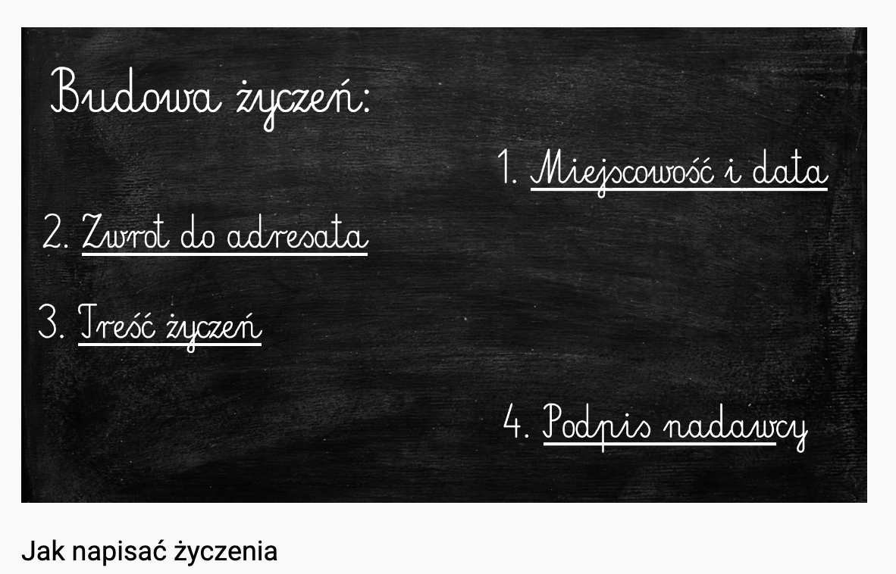
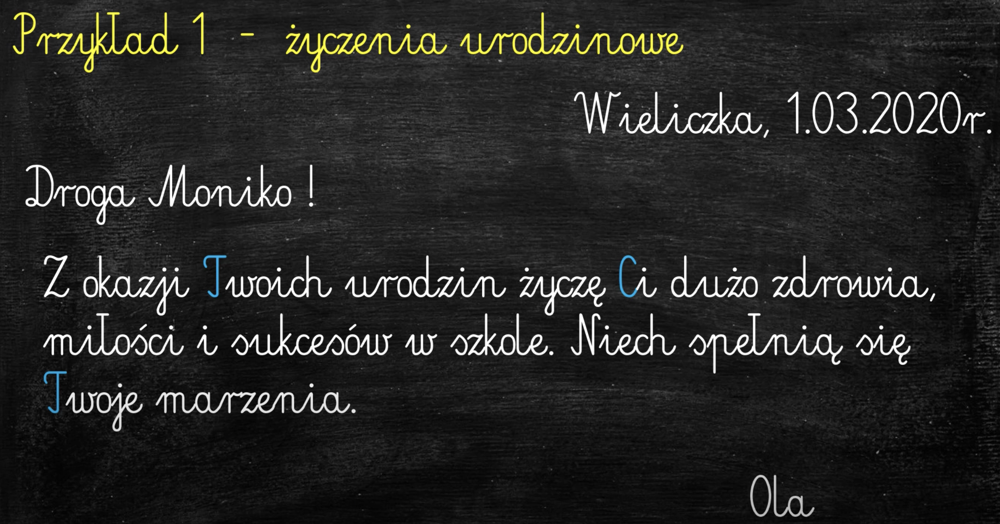
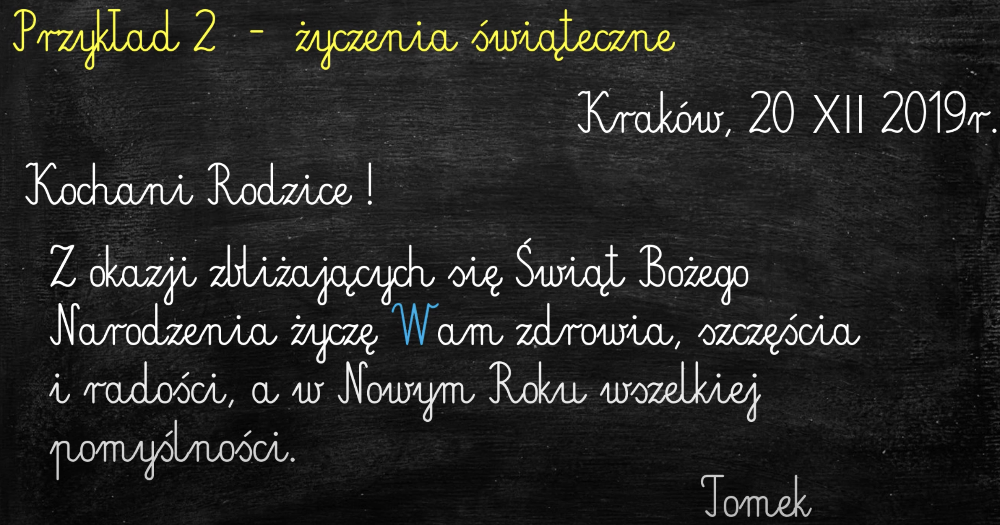

# Sprawozdanie
**Sprawozdanie** to relacja z jakiegoś prawdziwego wydarzenia, np. wycieczki, imprezy, uroczystości.

Autor sprawozdania przedstawia obiektywnie wydarzenia w kolejności chronologicznej, posługując się zrozumiałym i rzeczowym językiem:
- jako UCZESTNIK, czyli w narracji pierwszoosobowej (bezpośredniej),
- jako ŚWIADEK, czyli w narracji trzecioosobowej (pośredniej).

Sprawozdanie powinno zawierać informacje, które odpowiada na pytania:
- JAKIE to wydarzenie?
- KTO brał w nim udział?
- Gdzie i kiedy miało MIEJSCE?
- Jaki był jego PRZEBIEG?
Na zakończenie dodajemy własną opinię, ocenę wydarzenia, najlepiej z uzasadnieniem.

# Życienia

